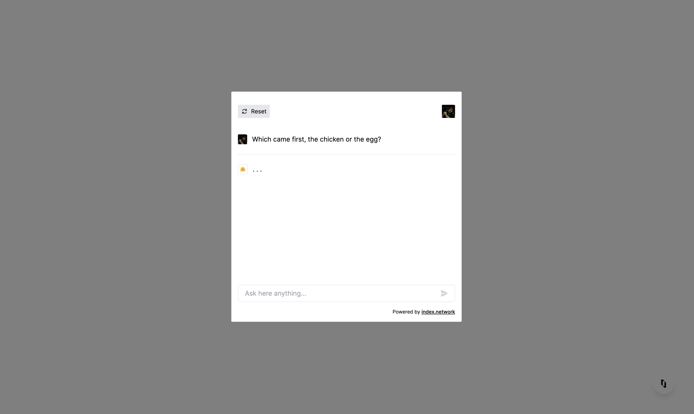
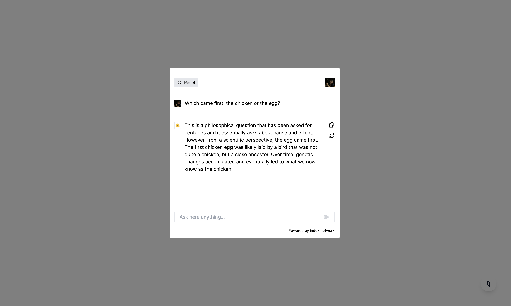

## About Index Chat

Index Chat is a chat application that is built on top of Indexes.
It provides best-designed chat experience for your users.

## Table of contents

1. [Features](#features)
2. [Screenshots](#screenshots)
3. [Getting started](#getting-started)
4. [Contributing](#contributing)
5. [License](#license)

## Features

- [x] **_100% TypeScript_**: Index Chat is written in TypeScript
- [x] **_Fully customizable_**: You can customize the look and feel of the chat
- [x] **_No dependencies_**: Index Chat has no dependencies except Hero Icons
- [x] **_User-friendly chatting experience_**: Index Chat is designed to be user-friendly
- [x] **_Unit Tests_**: Index Chat has unit tests
- [ ] Event streaming

## Screenshots




## Getting started

#### Import and Initialize

```tsx
import {IndexChat} from "@/components/chat";

export default function Home() {
    return (
        <div>
            <IndexChat/>
        </div>
    )
}
```

## Contributing

All contributions are welcome.
If you would like to contribute to this project, feel free to submit pull requests.
Prior to making significant changes, I recommend opening an issue to discuss the changes.

## License

This project is licensed under the MIT license. For more information, refer to the `LICENSE` file.
